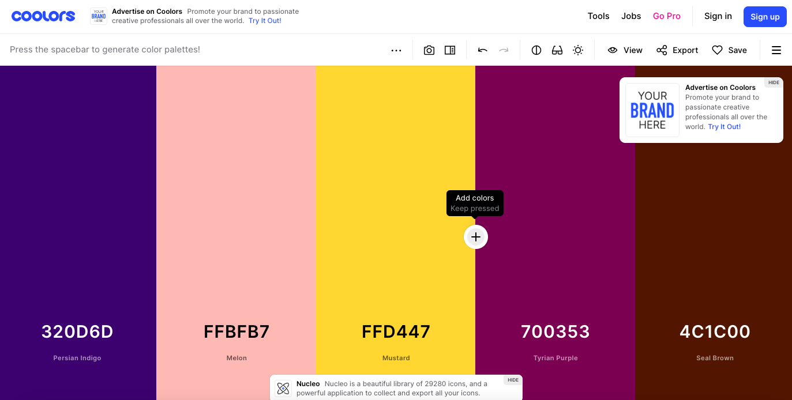
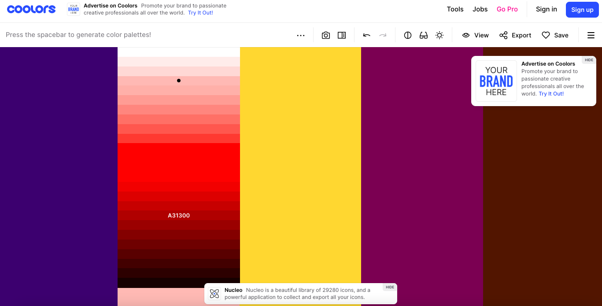
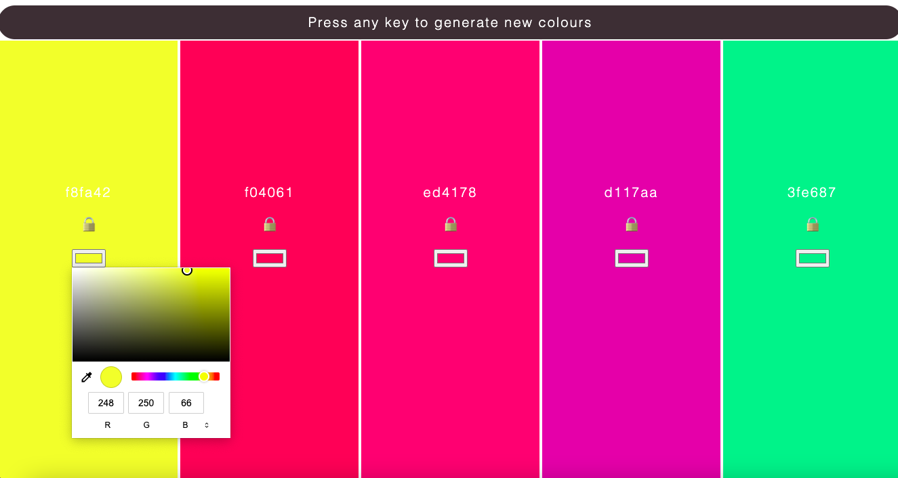

# Colour-palette

### We were tasked to create a colour palette similar to 

### Users can interact with the page by editing the randomly generated colours. 

# Developing the Colour Palette

## randomColor()

## changeColorManual()

## changeNameManual()

## Lock functions
